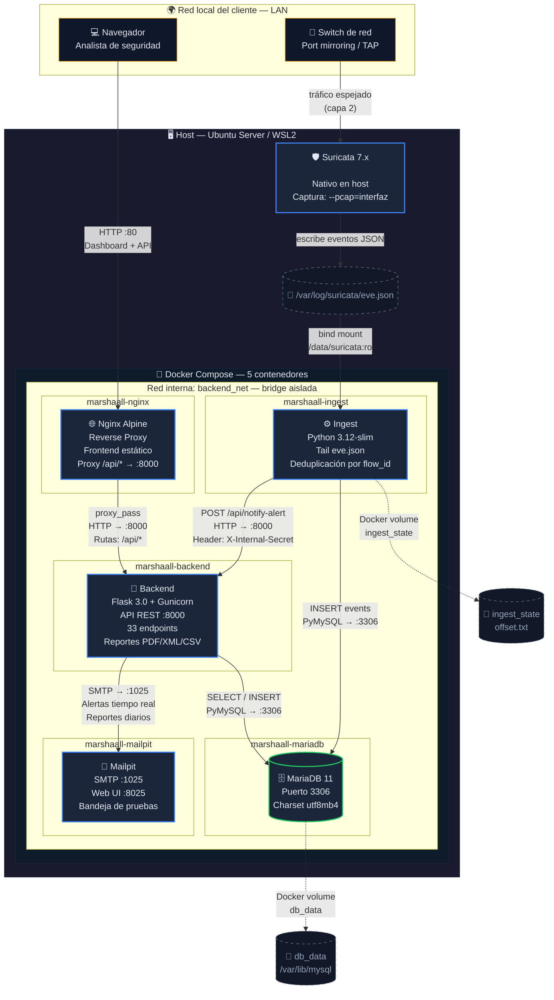

# Marshaall SIEM — Diagrama de arquitectura de red interna

## Diagrama completo

> Este diagrama muestra todos los contenedores Docker, el componente nativo Suricata,
> las comunicaciones entre servicios (protocolos y puertos), los volúmenes de persistencia
> y la conexión con la red local del cliente.



---

## Tabla de comunicaciones entre servicios

| Origen | Destino | Protocolo | Puerto | Ruta / Acción |
|---|---|---|---|---|
| Switch de red | Suricata (nativo) | Ethernet L2 | — | Tráfico espejado (port mirroring) |
| Suricata | Disco (`eve.json`) | Fichero | — | Escritura continua de eventos JSON |
| `marshaall-ingest` | `marshaall-mariadb` | MySQL | 3306 | `INSERT INTO events (...)` |
| `marshaall-ingest` | `marshaall-backend` | HTTP POST | 8000 | `/api/notify-alert` + `X-Internal-Secret` |
| `marshaall-backend` | `marshaall-mariadb` | MySQL | 3306 | `SELECT`, `INSERT`, `UPDATE` |
| `marshaall-backend` | `marshaall-mailpit` | SMTP | 1025 | Alertas en tiempo real + reportes diarios |
| `marshaall-nginx` | `marshaall-backend` | HTTP | 8000 | `proxy_pass` para rutas `/api/*` |
| Navegador (LAN) | `marshaall-nginx` | HTTP | **80** | Panel web + API REST |
| Navegador (LAN) | `marshaall-mailpit` | HTTP | **8025** | Interfaz web de correos |

## Puertos expuestos al host

| Servicio | Puerto host | Puerto contenedor | Uso |
|---|---|---|---|
| `marshaall-nginx` | **80** | 80 | Panel web + API REST |
| `marshaall-mailpit` | **8025** | 8025 | Interfaz web de Mailpit |
| `marshaall-mailpit` | **1025** | 1025 | Puerto SMTP de pruebas |

## Volúmenes de persistencia

| Nombre | Tipo | Ruta en contenedor | Función |
|---|---|---|---|
| `db_data` | Docker named volume | `/var/lib/mysql` | Datos de MariaDB |
| `ingest_state` | Docker named volume | `/state/` | Offset de lectura de `eve.json` |
| `/var/log/suricata` | Bind mount (read-only) | `/data/suricata/` | Fichero `eve.json` |
| `./frontend` | Bind mount (read-only) | `/usr/share/nginx/html/` | Frontend estático |
| `./nginx/default.conf` | Bind mount (read-only) | `/etc/nginx/conf.d/default.conf` | Config de Nginx |
| `./db/init` | Bind mount (read-only) | `/docker-entrypoint-initdb.d/` | Scripts SQL iniciales |
| `./frontend/imagenes` | Bind mount (read-only) | `/usr/share/nginx/html/imagenes/` | Logo para reportes |

## Dependencias de arranque (depends_on)

```
mariadb (arranca primero)
  ├── ingest (espera a mariadb)
  └── backend (espera a mariadb)
        └── nginx (espera a backend)

mailpit (independiente, sin dependencias)
```

## Red Docker

| Propiedad | Valor |
|---|---|
| Nombre | `backend_net` |
| Driver | `bridge` (por defecto) |
| Resolución DNS | Automática por nombre de servicio |
| Aislamiento | Completamente aislada del host — solo Nginx expone `:80` |
